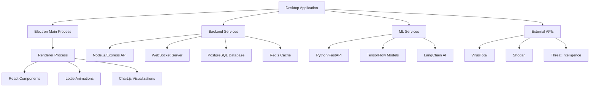

# Real-Time Cyber Forge Agentic AI Desktop Application

<div align="center">
  
  
  [](https://github.com/Haggai-dev665/Real-Time-cyber-Forge-Agentic-AI)
  [](LICENSE)
  [](https://electronjs.org/)
  [](https://github.com/Haggai-dev665/Real-Time-cyber-Forge-Agentic-AI)
</div>

## 🛡️ Advanced Cybersecurity Platform with AI Intelligence

Real-Time Cyber Forge Agentic AI is a comprehensive cybersecurity desktop application that leverages machine learning and agentic AI to provide real-time threat detection, security analytics, and intelligent security management.

### ✨ Key Features

- **🔍 Real-Time Monitoring**: Live analysis of web browsing patterns and network traffic
- **🤖 AI-Powered Threat Detection**: Advanced machine learning models for identifying security threats
- **🧠 Agentic AI Assistant**: Intelligent agent with memory capabilities for adaptive security learning
- **📊 Advanced Analytics Dashboard**: Comprehensive security metrics and visualizations
- **🔧 Backend Integration**: Seamless connectivity with databases and external APIs
- **🎨 Modern UI/UX**: Black and white themed interface with advanced animations
- **📱 Cross-Platform**: Available for Windows, macOS, and Linux

## 🖼️ Application Screenshots

### Main Dashboard

*The main dashboard provides an overview of security status, real-time threats, and system health monitoring with beautiful black and white themed interface.*

### Enhanced Sidebar Navigation

*Comprehensive sidebar with 30+ components organized into collapsible sections including Core Features, AI & ML, Security Tools, Backend Integration, and System Administration.*

### AI Assistant Interface

*Interactive AI assistant powered by advanced language models for security analysis and recommendations.*

### Real-Time Threat Center

*Live threat detection and analysis with detailed threat intelligence and response recommendations.*

### API Management Console

*Comprehensive API management interface for configuring backend services, ML endpoints, and external integrations.*

### Database Connector

*Advanced database connection manager with query console and real-time data visualization.*

### Security Analytics

*Detailed security metrics and analytics with interactive charts and threat trend analysis.*

## 🚀 Quick Start

### Prerequisites

- **Node.js** 18.0.0 or higher
- **Python** 3.9 or higher (for ML services)
- **PostgreSQL** (for data storage)
- **Redis** (for caching)

### Installation

1. **Clone the repository**
   ```bash
   git clone https://github.com/Haggai-dev665/Real-Time-cyber-Forge-Agentic-AI.git
   cd Real-Time-cyber-Forge-Agentic-AI
   ```

2. **Install dependencies**
   ```bash
   npm run install:all
   ```

3. **Start the desktop application**
   ```bash
   npm run dev:desktop
   ```

### Development Mode

For development with live reloading:

```bash
# Start all services
npm run dev

# Or start desktop app only
cd desktop-app
npm run dev
```

## 🏗️ Architecture Overview



## 🎨 Design & User Interface

### Color Scheme
The application features a sophisticated **black and white** color palette:
- **Primary**: Pure White (#FFFFFF)
- **Secondary**: Pure Black (#000000)
- **Accents**: Various shades of gray for depth and hierarchy
- **Status Colors**: Green (success), Red (danger), Yellow (warning), Blue (info)

### Advanced Animations
- **Lottie Animations**: Custom JSON-based animations for loading, scanning, and data visualization
- **CSS Transitions**: Smooth transitions for hover effects and state changes
- **Interactive Elements**: Responsive buttons, cards, and navigation components

### Component Library
The application includes 30+ carefully crafted components:

#### Core Components (5)
- Dashboard Overview
- Real-time Monitor
- Threat Center
- Deep Analysis
- System Overview

#### AI & Machine Learning (7)
- AI Assistant
- ML Models Management
- AI Insights
- Predictions
- Neural Networks
- Training Data
- Model Evaluation

#### Security Tools (8)
- Vulnerability Scanner
- Network Analysis
- Malware Detection
- Digital Forensics
- Penetration Testing
- Web Security
- Email Security
- Endpoint Security

#### Advanced Security (6)
- Incident Response
- Risk Assessment
- Security Metrics
- Threat Intelligence
- SOAR Platform
- Deception Technology

#### Backend Integration (5)
- API Management
- Database Connector
- Webhook Manager
- Service Health
- Data Pipeline

#### System Administration (6)
- Settings
- User Profile
- System Logs
- User Management
- Backup & Restore
- License Manager

## 🔌 Backend Integration

### API Management
- **RESTful API Support**: Full CRUD operations with any REST API
- **WebSocket Connections**: Real-time bidirectional communication
- **Authentication**: Support for Bearer tokens, API keys, and Basic auth
- **Health Monitoring**: Automatic service health checks and status reporting

### Database Connectivity
Supports multiple database types:
- **PostgreSQL**: Primary database for structured data
- **MongoDB**: Document storage for analytics data
- **Redis**: High-performance caching and session storage
- **MySQL**: Legacy system integration
- **SQLite**: Local data storage
- **Elasticsearch**: Full-text search and log analysis

### ML Service Integration
- **TensorFlow Models**: Deep learning for threat detection
- **LangChain AI**: Natural language processing and reasoning
- **Custom Algorithms**: Proprietary security analysis algorithms
- **Real-time Inference**: Live threat scoring and classification

## 🤖 AI Features

### Agentic AI Capabilities
- **Memory System**: Persistent learning from security events
- **Contextual Analysis**: Understanding of environment and threats
- **Adaptive Responses**: Learning from user interactions and feedback
- **Predictive Analytics**: Forecasting potential security risks

### Machine Learning Models
- **Threat Classification**: Binary and multi-class threat detection
- **Anomaly Detection**: Behavioral analysis for unusual patterns
- **Natural Language Processing**: Analysis of security reports and logs
- **Computer Vision**: Image-based malware detection

## 📊 Analytics & Reporting

### Real-Time Dashboards
- **Live Threat Feed**: Continuous monitoring of security events
- **Performance Metrics**: System health and response times
- **User Activity**: Browsing patterns and risk assessment
- **Geographic Analysis**: Location-based threat mapping

### Export Capabilities
- **PDF Reports**: Comprehensive security assessments
- **CSV Data**: Raw data export for further analysis
- **JSON API**: Programmatic access to all metrics
- **Custom Formats**: Configurable export templates

## 🔒 Security Features

### Data Protection
- **End-to-End Encryption**: All data encrypted in transit and at rest
- **Local Processing**: Sensitive analysis performed locally
- **Privacy First**: No data sent to external services without consent
- **Audit Trails**: Complete logging of all security events

### Compliance
- **GDPR Compliant**: European data protection standards
- **SOC 2 Ready**: Security framework compliance
- **ISO 27001**: Information security management
- **NIST Framework**: Cybersecurity framework alignment

## 🛠️ Development

### Technology Stack
- **Frontend**: Electron, HTML5, CSS3, JavaScript ES6+
- **Backend**: Node.js, Express, WebSocket
- **Database**: PostgreSQL, Redis, MongoDB
- **AI/ML**: Python, TensorFlow, LangChain
- **Animations**: Lottie.js, CSS Animations
- **Charts**: Chart.js, D3.js
- **Testing**: Jest, Playwright

### Code Quality
- **ESLint**: JavaScript linting and code standards
- **Prettier**: Code formatting and consistency
- **Husky**: Git hooks for quality assurance
- **Jest**: Unit and integration testing
- **Documentation**: Comprehensive inline and external docs

### Build & Deployment
```bash
# Build for production
npm run build

# Create distributable packages
npm run dist

# Run tests
npm test

# Lint code
npm run lint
```

## 📚 Documentation

### User Guides
- [Installation Guide](docs/installation.md)
- [User Manual](docs/user-manual.md)
- [Configuration Guide](docs/configuration.md)
- [Troubleshooting](docs/troubleshooting.md)

### Developer Documentation
- [API Reference](docs/api-reference.md)
- [Architecture Guide](docs/architecture.md)
- [Contributing Guidelines](docs/contributing.md)
- [Plugin Development](docs/plugin-development.md)

### Advanced Topics
- [Machine Learning Models](docs/ml-models.md)
- [Custom Integrations](docs/integrations.md)
- [Performance Tuning](docs/performance.md)
- [Security Hardening](docs/security.md)

## 🤝 Contributing

We welcome contributions from the cybersecurity and developer community!

### Ways to Contribute
- **Bug Reports**: Help us identify and fix issues
- **Feature Requests**: Suggest new functionality
- **Code Contributions**: Submit pull requests
- **Documentation**: Improve guides and references
- **Testing**: Help with quality assurance

### Development Setup
1. Fork the repository
2. Create a feature branch
3. Install dependencies: `npm run install:all`
4. Make your changes
5. Run tests: `npm test`
6. Submit a pull request

## 📄 License

This project is licensed under the MIT License - see the [LICENSE](LICENSE) file for details.

## 🙏 Acknowledgments

- **TensorFlow Team**: For the powerful ML framework
- **Electron Community**: For the cross-platform desktop framework
- **LangChain**: For the AI agent capabilities
- **Chart.js**: For beautiful data visualizations
- **Lottie**: For smooth animations

## 📞 Support

### Community Support
- **GitHub Issues**: [Report bugs and feature requests](https://github.com/Haggai-dev665/Real-Time-cyber-Forge-Agentic-AI/issues)
- **Discussions**: [Join community discussions](https://github.com/Haggai-dev665/Real-Time-cyber-Forge-Agentic-AI/discussions)
- **Discord**: [Join our developer community](https://discord.gg/cyber-forge-ai)

### Professional Support
- **Enterprise Support**: Available for business customers
- **Custom Development**: Tailored solutions for specific needs
- **Training**: Professional training programs available

---

<div align="center">
  <p><strong>Built with ❤️ by the Cyber Forge AI Team</strong></p>
  <p>© 2024 Cyber Forge AI. All rights reserved.</p>
</div>