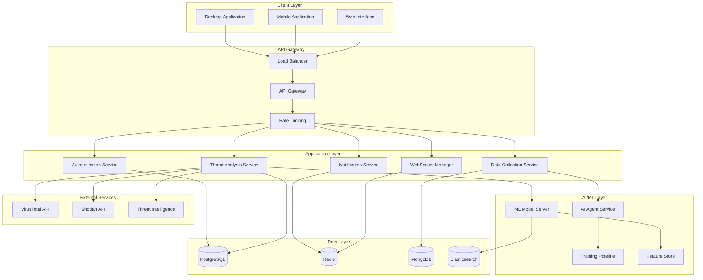
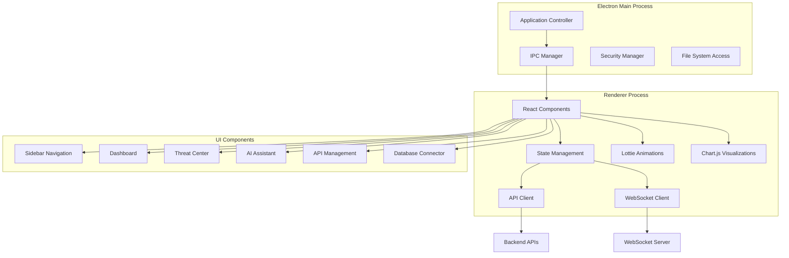
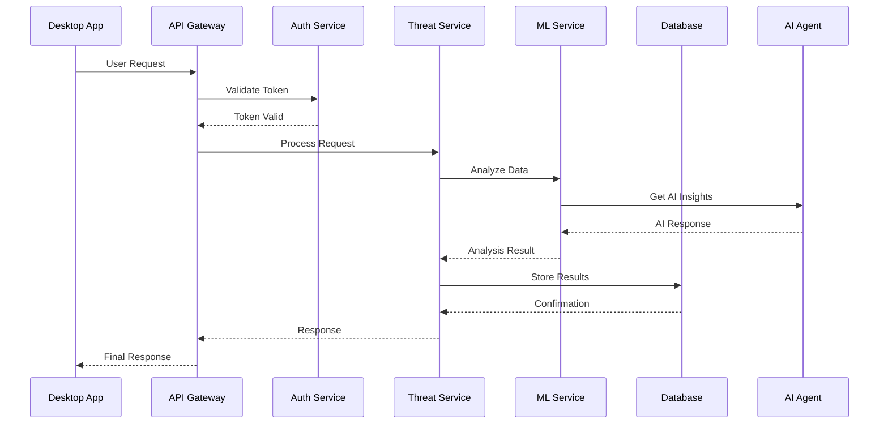
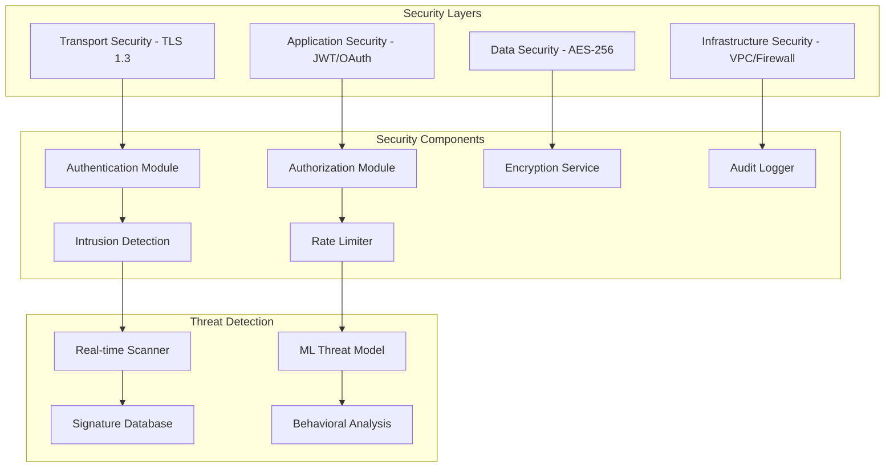
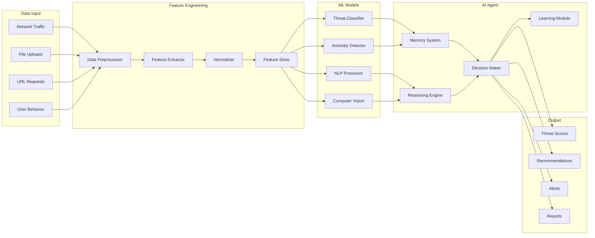
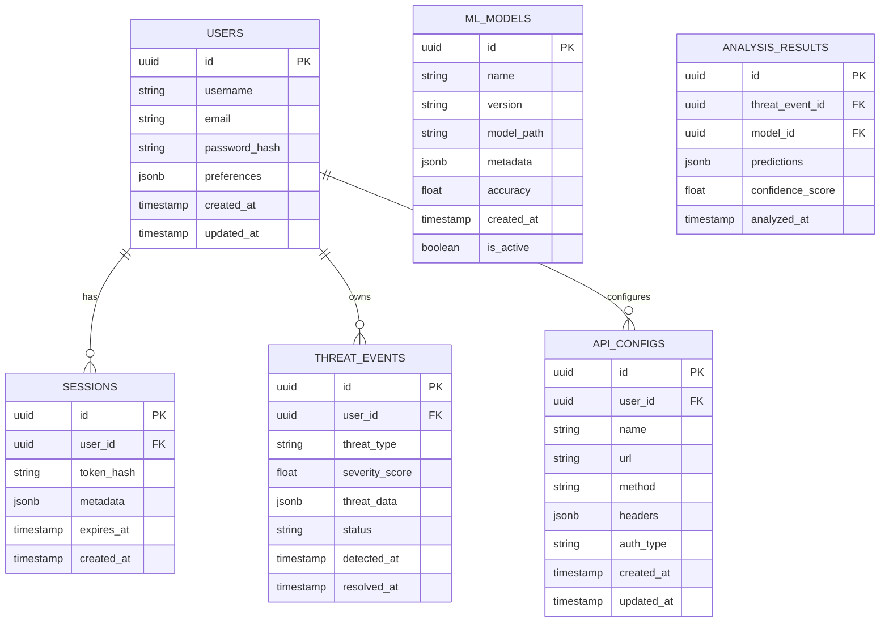
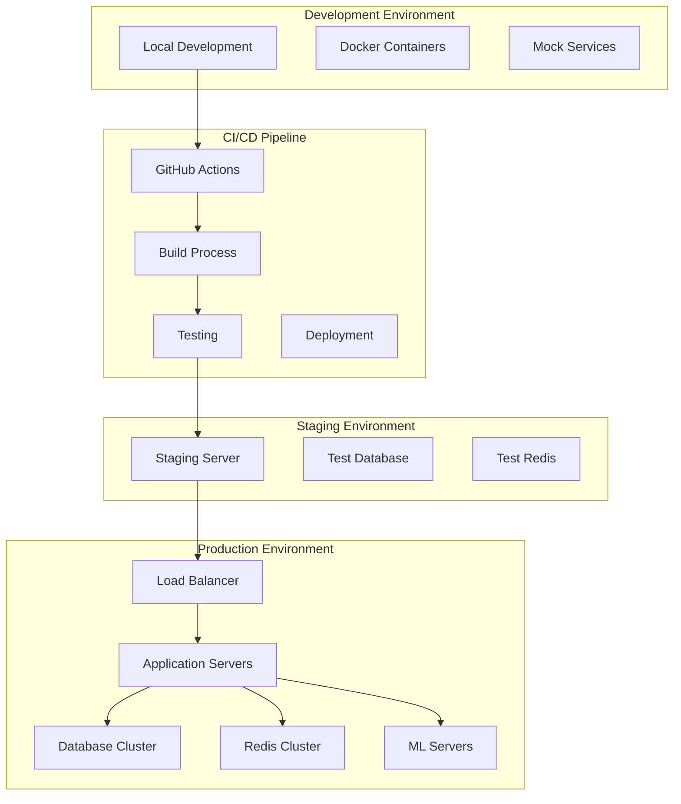
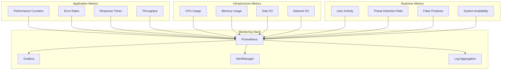

# System Architecture Documentation

## Overview

The Real-Time Cyber Forge Agentic AI platform is built using a modern microservices architecture that separates concerns across multiple layers: presentation, application logic, data persistence, and AI/ML processing.

## High-Level Architecture



## Component Architecture

### Desktop Application Architecture



## Data Flow Architecture



## Security Architecture



## AI/ML Architecture



## Database Schema

### Core Tables



## Deployment Architecture



## Performance Considerations

### Scalability Patterns

1. **Horizontal Scaling**: Multiple application instances behind load balancer
2. **Database Sharding**: Partition data across multiple database instances
3. **Caching Strategy**: Multi-level caching with Redis and in-memory caches
4. **Async Processing**: Background jobs for ML processing and data analysis

### Monitoring Architecture



## Technology Stack Details

### Frontend Technologies
- **Electron**: Cross-platform desktop framework
- **HTML5/CSS3**: Modern web standards
- **JavaScript ES6+**: Modern JavaScript features
- **Lottie.js**: Animation library
- **Chart.js**: Data visualization
- **Font Awesome**: Icon library

### Backend Technologies
- **Node.js**: JavaScript runtime
- **Express.js**: Web application framework
- **WebSocket**: Real-time communication
- **JWT**: Authentication tokens
- **bcrypt**: Password hashing

### Database Technologies
- **PostgreSQL**: Primary relational database
- **Redis**: In-memory cache and session store
- **MongoDB**: Document database for analytics
- **Elasticsearch**: Search and analytics engine

### AI/ML Technologies
- **Python**: ML development language
- **TensorFlow**: Deep learning framework
- **scikit-learn**: Machine learning library
- **LangChain**: AI agent framework
- **FastAPI**: ML service API framework

## Configuration Management

### Environment Configuration

```yaml
# config/production.yml
database:
  host: ${DB_HOST}
  port: ${DB_PORT}
  name: ${DB_NAME}
  ssl: true
  pool:
    min: 2
    max: 10

redis:
  host: ${REDIS_HOST}
  port: ${REDIS_PORT}
  db: 0
  password: ${REDIS_PASSWORD}

ml_service:
  url: ${ML_SERVICE_URL}
  timeout: 30000
  retry_attempts: 3

security:
  jwt_secret: ${JWT_SECRET}
  session_timeout: 3600
  rate_limit: 100
```

### Feature Flags

```javascript
// Feature flag configuration
const features = {
  advanced_ai: true,
  real_time_scanning: true,
  experimental_models: false,
  beta_ui: false
};
```

This architecture provides a solid foundation for a scalable, secure, and maintainable cybersecurity platform with advanced AI capabilities.