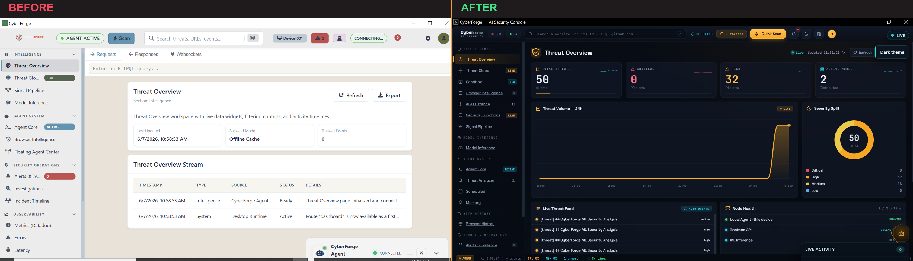
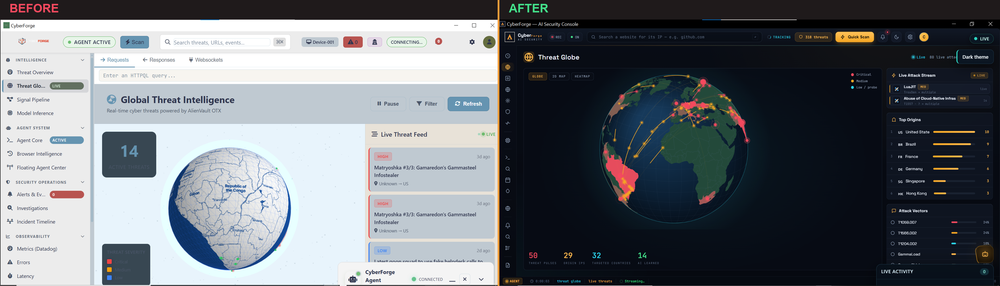
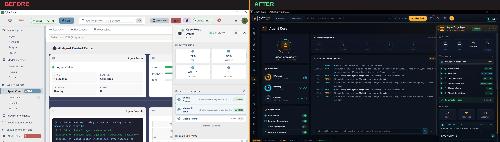
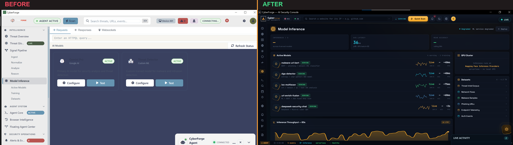
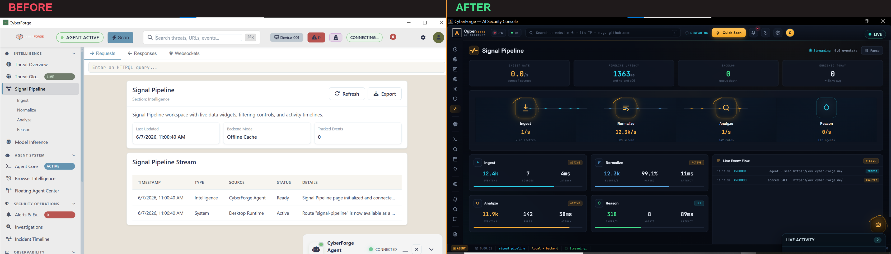
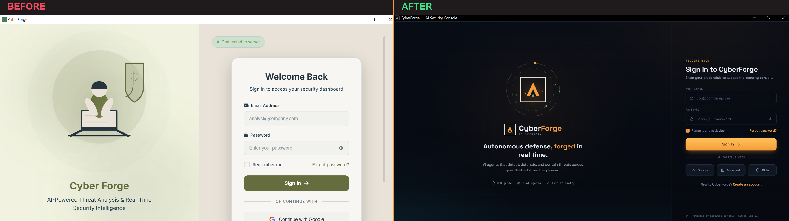

*This is a submission for the [GitHub Finish-Up-A-Thon Challenge](https://dev.to/challenges/github-2026-05-21)*

# What I Built
## CyberForge

### Your own personal cyber‑security team, living quietly inside your computer.

Every day, your web browser quietly visits hundreds of places — websites, links from
emails, adverts, pop‑ups, things you click without thinking. Most are harmless. A few
are traps: fake login pages, scams, and sites built to steal your passwords, your money,
or your identity.

The problem is, those dangerous ones look *exactly* like the safe ones. You can't tell
the difference just by looking — and the criminals are counting on that.

**CyberForge is an intelligent guard that watches the doors for you.** It sits on your
computer, understands where you've been online, recognises danger the moment it appears,
and tells you — in plain English — what's safe, what's risky, and what to do about it.

Think of it as having a calm, tireless security expert sitting beside you 24 hours a day —
one who never gets bored, never looks away, and never misses a thing.

---

## What it actually does for you

**It keeps an eye on where you go online.**
CyberForge sees the websites your browsers have visited and checks each one for danger —
automatically, in the background. You don't have to do anything. It's already working.

**It spots the traps before they catch you.**
Using artificial intelligence, it examines a website the way a seasoned investigator would:
Is this really the bank's website, or a clever fake? Has anyone else reported this link as a
scam? Does this page behave the way a trustworthy one should? Then it gives you a simple
verdict — safe, suspicious, or dangerous.

**It can slam the door on bad sites.**
Found something nasty? With one click, CyberForge can block it — so that site simply can't
open on your computer again. No technical know‑how required.

**It has a security expert you can just… talk to.**
There's a built‑in assistant powered by advanced AI. Ask it anything — *"Is this email link
safe?"*, *"What were the riskiest sites I visited this week?"*, *"What should I do about this
warning?"* — and it answers in clear, everyday language, because it actually remembers
everything CyberForge has seen on your machine.

**It shows you the world's live threats on a glowing globe.**
A beautiful, real‑time map of the planet lights up with genuine cyber‑attacks as they happen
around the world — pulled from global threat‑intelligence networks. It's your own
mission‑control view of the internet's weather.

**It writes you a proper report — instantly.**
Want to know what's been going on? Pick a time frame — the last few hours, a day, a week, a
month — and CyberForge produces a detailed, professional security report: what you did, what
it found, what it dealt with, and what it recommends next. You can save it as a clean PDF and
share it with anyone.

**It remembers, so it gets smarter about *you*.**
Everything it learns — every scan, every threat, every action — is stored as its own memory.
Over time it builds a real understanding of your digital life and the dangers that target it
specifically.

---

## The part that really matters

**Everything stays on your computer.**

CyberForge does not ship your private browsing, your data, or your secrets off to some
company's servers in the cloud. There's no hidden data‑harvesting, no selling your
information. Your machine is your machine. The intelligence runs *for you*, *on your side*,
*in your home* — and the records of what it sees never leave your device unless you choose to
share them.

In a world where almost every untrusted app wants to collect everything about you, CyberForge
does the opposite. It protects you *and* your privacy at the same time.

---

## Where you can use it

CyberForge runs as a polished desktop application on **Windows, macOS, and Linux**. It installs
like any normal program, sets itself up automatically, and starts protecting you the moment it
opens — running continuously in the background while you go about your everyday work on the
internet.

---

## Why it matters to me

Cyber‑crime is now one of the largest and fastest‑growing threats in the world — costing
ordinary people and businesses dearly, and hitting individuals who never thought they'd be a
target. The defences that used to be reserved for big corporations with their own IT
departments are exactly what everyday people now need.

Growing up in a less‑privileged community in Africa, individuals — including myself — often
can't afford high‑end computing resources, premium entertainment, or licensed software. That
pushes people to unknowingly visit malicious and phishing sites while searching for free
movies, cracked software and streaming — and they pay for it with stolen accounts and stolen
money. I built CyberForge for *them*: the people who are most exposed and least protected.

**CyberForge takes that corporate‑grade protection, wraps it in artificial intelligence, and
hands it to you in something as simple to use as a weather app.**

It's not a lock you have to remember to use, or a course you have to study. It's a quiet,
brilliant guardian that's simply *always there* — watching, understanding, and keeping you safe.

> **CyberForge — security that thinks, so you don't have to worry.**

---

## Demo

🔗 **Repository:** https://github.com/Haggai-dev665/Real-Time-cyber-Forge-Agentic-AI
🎥 **Video walkthrough:** https://youtu.be/d5GLapNKSKk



> 📸 **When you publish on DEV:** each comparison below is a single side‑by‑side image — drag‑and‑drop
> it into the editor and replace its `images/compare/...` path with the URL DEV gives you (just 6
> images). Single images render reliably on DEV, unlike images placed inside tables. The ``
> tag above renders as an inline YouTube player automatically.

The story of this project is best told **side by side**. On the left is where each screen
*started* — a convincing shell filled with mock data. On the right is where the Finish‑Up‑A‑Thon
took it — the same screen, now wired to live, on‑device functionality.

### Threat Overview — your situational dashboard

*The dashboard once showed hard‑coded numbers. Now the threat counts, critical/high alerts and
overall posture are computed from real scans of the pages you actually visit — the first place
you look to know whether everything is calm.*

### Threat Globe — live worldwide attacks

*What used to be a decorative graphic is now a real, interactive 3‑D globe streaming genuine
attacks from global threat‑intelligence feeds (AlienVault OTX) — and the agent learns from those
pulses into its memory.*

### Agent Core — agentic AI that decides and acts

*The agent panel was scripted theatre. Now an autonomous agent reasons through each threat
step‑by‑step and streams its thinking live, and the floating agent follows you onto every screen
to scan whatever page you're viewing.*

### Model Inference — the ML detection engines

*The "models" were just labels on a page. Now this screen reports the real detection engines —
phishing/URL classification, DGA detection and IOC scanning — and their live readiness.*

### Signal Pipeline — from page to verdict, in real time

*A pretty flowchart became an actual pipeline: active‑tab capture → backend ML + local
heuristics → DeepSeek confirmation → blended verdict → action, with each stage reflecting real
scans as they happen.*

### Sign‑in — secure, local‑first access

*The login was a façade. Now it's a real authenticated session, with the token stored in the OS
keychain and restored on launch so the on‑device intelligence is ready the moment you open the app.*

---

## The Comeback Story

CyberForge didn't start as a finished product — it started as an **ambitious shell**.

Before the finish‑up, it *looked* like a security operations centre: a beautiful multi‑page
desktop UI with a threat dashboard, an agent panel, a globe, charts and a sidebar full of
screens. But under the surface, the brain wasn't connected. Pages were filled with **mock
data**, scans didn't really decide anything, the "AI assistant" couldn't see the system, the
reports were templates, and the whole thing didn't actually *protect* anyone. It was a
convincing demo of a security tool — not a security tool.

*(The before/after gallery above is exactly that story, screen by screen — the left column is the
mannequin; the right column is the working tool.)*

During the Finish‑Up‑A‑Thon I tore out the mannequin and wired in a real nervous system. Page
by page, the placeholders became live, on‑device functionality:

- **Real detection.** The scanner now reads the page you're actually viewing (active‑tab
  aware, across browsers) and blends a backend ML verdict with local URL + page‑content
  heuristics, a trusted‑domain allow‑list and a DeepSeek confirmation pass. It even **solves
  the anti‑bot "checking your browser" challenge** that free‑hosting phishing sites use to hide
  from scanners — so it sees the real credential‑stealing page that everything else misses.
- **It acts, not just displays.** One click genuinely blocks a site through the operating
  system's hosts file; protect and allow lists are real; and when a phishing page is confirmed,
  an **always‑on‑top alert** pops over your browser *even when CyberForge is minimized*.
- **A real assistant + real reports.** The AI assistant is grounded in a local vector memory of
  every scan, intel pulse and action, and the Reports screen writes a detailed, LaTeX‑styled PDF
  for any time window from that same memory.
- **Genuinely private + genuinely shippable.** Everything stays on the device. I self‑hosted the
  fonts (so the packaged build looks identical to dev), added a proper first‑run filesystem,
  installers, an uninstaller and build docs, and a working Settings screen.

The comeback, in one line: **CyberForge went from a UI that *pretended* to protect you to a
tool that actually does — running locally, deciding for itself, and warning you in time.**

---

## My Experience with GitHub Copilot

Finishing a project this broad — a Rust + Tauri desktop app, a backend, ML services and a
mobile companion — would have stalled without an AI pair‑programmer. Copilot was less an
autocomplete and more a second engineer that let me move across the whole stack without losing
momentum.

Where it genuinely moved the needle:

- **Untangling the hardest bug of the whole build.** My hosted phishing test sites kept scanning
  as "safe." Copilot helped me trace it to a free‑host **anti‑bot interstitial** (an `aes.js`
  JavaScript challenge) that the scanner couldn't get past — and then helped me implement a
  **from‑scratch AES‑128** in Rust to solve the challenge and fetch the real page. That was the
  difference between detection that *looked* clever and detection that actually works.
- **Wiring Tauri end‑to‑end.** It sped up the fiddly parts — registering commands, the
  always‑on‑top alert window, the per‑window capabilities/permissions, and the bridge between
  the Rust backend and the HTML/JS front‑end — so I could focus on behaviour instead of
  boilerplate.
- **Killing "works‑in‑dev, breaks‑in‑build" issues.** It helped me diagnose why the packaged app
  rendered differently from `tauri dev` (fonts loading from a CDN) and self‑host the fonts so the
  installer matches dev exactly.
- **Refactoring for reuse.** Shared logic — the findings‑report engine used by both the Reports
  page and the AI Assistant, the prewarm cache, the threat‑action buttons — came together far
  faster with an assistant suggesting the extraction and catching the knock‑on edits.
- **Explaining as it went.** Because it talked through *why* a change was needed (Tauri's
  camel‑casing of command arguments, CSP rules, hosts‑file enforcement needing admin), I learned
  the platform while finishing the product instead of just pasting fixes.

The honest takeaway: Copilot didn't replace the thinking, but it removed the friction. It turned
a sprawling, half‑finished idea into something I could actually *finish* — and finish well —
inside the time I had.

---

*Built with ❤️ for the people who are most exposed online and least protected.*
