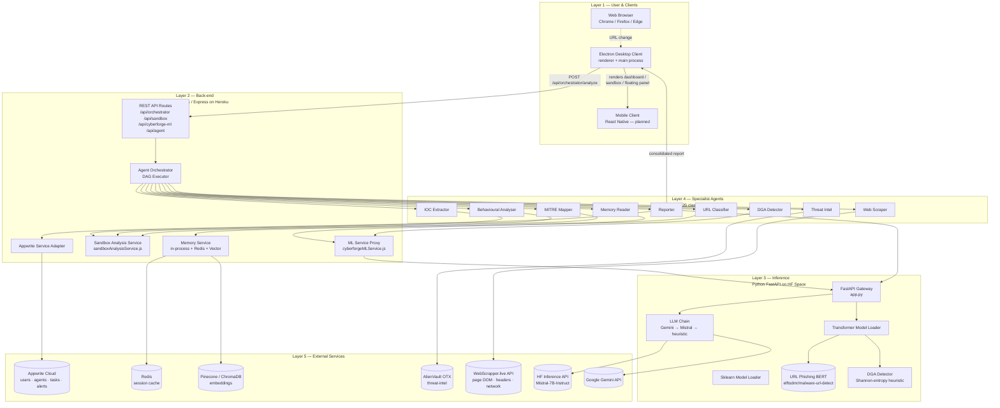
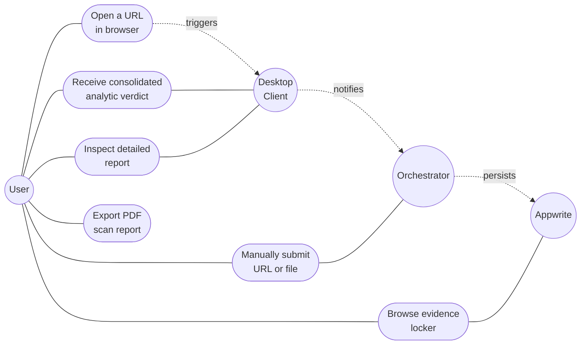
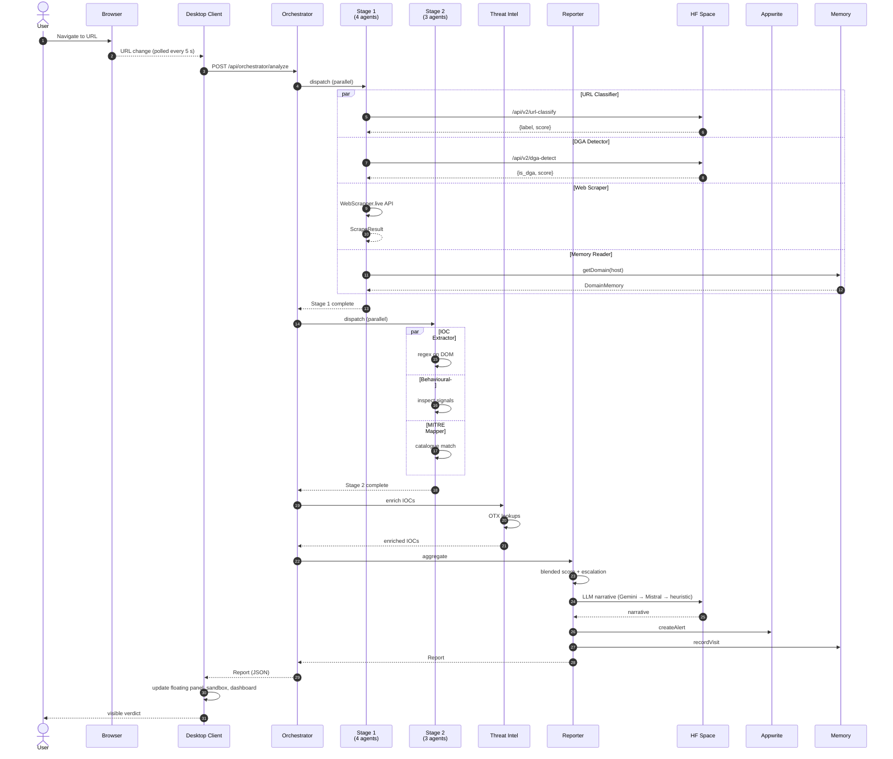

# CHAPTER 3: MATERIALS AND METHODS

## 3.1 Introduction

This chapter documents the materials and methods used to design, implement, deploy, and evaluate the CyberForge system. It is organised in nine sections. §3.2 presents the overall system architecture as a layered diagram with an accompanying narrative description of each component. §3.3 develops the canonical use case — *"User browses a URL"* — in conventional use-case-template form, with pre-conditions, post-conditions, a main success scenario, and alternate flows. §3.4 presents the class diagram of the orchestrator subsystem and explains the role of each class. §3.5 enumerates the hardware and software materials. §3.6 describes the development methodology and the iterative agile process by which the system was built. §3.7 details the eight-agent pipeline and its data dependencies. §3.8 documents the data flow from URL trigger to persisted alert. §3.9 enumerates the implementation stack. §3.10 sets out the evaluation methodology that is reported on in Chapter 5.

The diagrams in this chapter are rendered in Mermaid syntax, which produces machine-renderable vector graphics in any markdown viewer that supports it (including GitHub, GitLab, Obsidian, and most modern static-site generators). Where a diagram element has a counterpart in the implementation, the file path of that counterpart is cited inline.

## 3.2 System Architecture

CyberForge is a five-layer system. The user is at the topmost layer, interacting with the system primarily through an Electron desktop client; a mobile client is planned but is not the subject of this thesis. Below the desktop client sits a Node.js / Express back-end deployed to the Heroku PaaS, which in turn delegates inference to a Python FastAPI service hosted on a Hugging Face Space. The lowest layer comprises external services — Appwrite for persistence and authentication, Redis for in-memory caching, Pinecone or ChromaDB for vector similarity search, and AlienVault OTX for threat-intelligence lookups.

### 3.2.1 Architecture Diagram

The following Mermaid diagram presents the system at the level of layers and principal data flows.

### 3.2.2 Component Description

**Electron Desktop Client.** Located in `desktop-app/src/renderer/`, the desktop client is a single-page application running inside an Electron shell. The renderer process hosts the UI components: a sidebar with thirty navigation entries, a floating agent panel that visualises the eight-agent pipeline in real time, and a sandbox screen for static analysis. A `_pollActiveUrls()` function polls the operating system every five seconds for the currently active browser tab URL; new URLs trigger the orchestrator pipeline. The main process exposes a Tauri/Electron bridge for browser detection.

**Express Back-end.** Located in `backend/src/`, the back-end is a Node.js / Express application deployed to Heroku as a Procfile-driven web dyno. It exposes some thirty REST endpoints grouped by domain: `/api/auth`, `/api/threats`, `/api/agent`, `/api/cyberforge-ml`, `/api/sandbox`, and `/api/orchestrator`. The two most important services in the back-end for this thesis are `cyberforgeMLService.js` (the ML-proxy and verdict-aggregation layer) and `sandboxAnalysisService.js` (the IOC extraction, MITRE mapping, and evidence-locker layer).

**FastAPI Gateway on Hugging Face Spaces.** Located in `ml-services/hf_space_deploy/app.py`, the gateway is a Python FastAPI application that runs inside a Hugging Face Space. It loads two classes of model: a `MLModelLoader` that lazily loads scikit-learn pickled artefacts from the `Che237/cyberforge-models` repository, and a `TransformerModelLoader` that lazily loads Transformer pipelines (currently the `elftsdmr/malware-url-detect` BERT classifier). The gateway also implements the LLM fallback chain, attempting Gemini first (when an API key is configured), Mistral-7B-Instruct via the Hugging Face Inference API second, and a deterministic template third.

**Specialist Agents.** Each of the eight agents — URL Classifier, DGA Detector, Web Scraper, Memory Reader, IOC Extractor, Behavioural Analyser, MITRE Mapper, Threat Intel — is implemented as a class in `backend/src/agent/specialists/`. Each class exposes an `async execute(context)` method that takes a shared `ScanContext` object, performs its specific analysis, populates a slot in the context, and returns a `{ status, latencyMs, agent }` summary. The Reporter agent runs at the end of the pipeline and synthesises the contents of the context into the final report.

**External Services.** Appwrite Cloud is consumed via the official Node SDK and is used for user accounts, device registrations, agent registration, task queues, and the alert collection that stores consolidated reports. Redis is consumed via the standard `redis` client (with an in-memory mock fallback if the connection fails). Pinecone (or ChromaDB if Pinecone is unavailable) is consumed for vector similarity search over historical observations. OTX is consumed for IOC reputation lookups. The web scraper is a third-party service at `webscrapper.live` that returns rendered DOM, network requests, response headers, console logs, and security headers for a given URL.

## 3.3 Use Case: User Browses a URL

The principal use case of the system is the canonical interaction in which a user opens a new web page in their browser and CyberForge automatically analyses that page. The use case is presented below in the standard template of Cockburn (2001).

### 3.3.1 Use Case Diagram

### 3.3.2 Detailed Use Case Description: UC-01 *Analyse Browsed URL*

| Field | Value |
|-------|-------|
| **Use Case ID** | UC-01 |
| **Name** | Analyse Browsed URL |
| **Primary Actor** | User (any authenticated CyberForge user) |
| **Secondary Actors** | Desktop Client, Agent Orchestrator, Eight Specialist Agents, Hugging Face Space, Appwrite, OTX |
| **Stakeholders** | User (wants safety), Researcher (wants explainable verdicts), Operator (wants persistent logs) |
| **Pre-conditions** | The desktop client is running. The user is authenticated. The back-end is reachable. |
| **Trigger** | The active-tab URL polling interval (default 5 seconds) detects a new URL distinct from the most recently analysed URL. |
| **Post-conditions (Success)** | (i) A consolidated `Report` record is persisted to the Appwrite `alerts` collection; (ii) the desktop floating panel reflects the eight agents' status transitions; (iii) the user is presented with the verdict (`clean` / `low-risk` / `suspicious` / `malicious`), the blended risk score, and a one-paragraph narrative; (iv) if the verdict is `suspicious` or `malicious`, a toast notification is shown. |
| **Post-conditions (Failure)** | (i) The user is informed that analysis failed; (ii) a fallback verdict of `unknown` is recorded; (iii) the failure is logged in the system-logs ring buffer with the offending HTTP status. |

#### Main Success Scenario

1. The browser monitor detects that the user has navigated to a new URL `u`.
2. The desktop client constructs a `POST /api/orchestrator/analyze` request with `{ url: u, sessionId, userId }` and dispatches it to the back-end.
3. The back-end constructs a `ScanContext` and dispatches *Stage 1* of the DAG: URL Classifier, DGA Detector, Web Scraper, and Memory Reader run in parallel.
4. The URL Classifier calls the Hugging Face Space `/api/v2/url-classify` endpoint, which loads the BERT pipeline (lazy on first call) and returns a probability vector over `{benign, malicious}`.
5. The DGA Detector calls `/api/v2/dga-detect`, which evaluates the Shannon-entropy heuristic on the second-level domain and returns a `{legit, dga}` verdict.
6. The Web Scraper calls the WebScrapper.live API and obtains the rendered DOM, network requests, response headers, and console logs.
7. The Memory Reader looks up the domain in the in-process domain history, in Redis, and (if available) in the vector store; it returns the number of prior visits and the most recent verdict.
8. Stage 1 completes. The back-end dispatches *Stage 2*: IOC Extractor, Behavioural Analyser, and MITRE Mapper run in parallel, all consuming the scraped page content.
9. The IOC Extractor applies ten regular-expression patterns to the page content and returns a deduplicated list of `{type, value, severity, source}` records.
10. The Behavioural Analyser inspects the network requests, console logs, JavaScript activity, form fields, and cookies for suspicious patterns (eval calls, mixed content, suspicious API usage).
11. The MITRE Mapper consults a 20-signal pattern catalogue and produces a list of `{techniqueId, name, tactic, confidence, evidence}` records.
12. Stage 2 completes. *Stage 3* dispatches the Threat Intel agent, which iterates over the extracted IOCs and queries the OTX API for each.
13. Once Stage 3 completes, the Reporter agent runs. It computes the blended risk score (60 % average of agent threat scores + 40 % maximum), applies the verdict-escalation rule (raise verdict if two or more high-confidence MITRE techniques fired, or if three or more high-severity IOCs were found), and constructs the consolidated report.
14. The Reporter invokes the LLM fallback chain to produce a one-paragraph narrative explanation. The chain attempts Gemini first; on failure, it falls through to Mistral-7B; on further failure, it produces a deterministic template.
15. The Reporter persists the consolidated record to Appwrite via the Appwrite Service Adapter, writes a one-line summary to the Memory Service for inclusion in future visits, and returns the report to the back-end.
16. The back-end returns the report to the desktop client in the response body.
17. The desktop client updates the floating panel (each of the eight agent cells transitions from *running* to *ok* or *failed*), updates the live URL feed, writes a console-style log entry, and — if `riskScore ≥ 30` — shows a toast notification.

#### Alternate Flows

- **AF-01: Web scraper unreachable.** If step 6 fails, the Web Scraper agent returns a `failed` status with the error message. Stage 2 agents that depend on the scraper output run against an empty page object and produce empty findings. The pipeline continues; the resulting verdict is downgraded accordingly.
- **AF-02: LLM unavailable.** If both Gemini and Mistral are unavailable in step 14, the Reporter constructs a deterministic narrative template using the structured findings.
- **AF-03: Appwrite write fails.** If step 15 fails, the Reporter logs the error and returns the report to the client; the report is not persisted but the user still receives the analysis.
- **AF-04: Repeat URL.** If the URL has been analysed within the past sixty seconds (deduplication window), the desktop client suppresses the duplicate trigger and uses the cached previous result.
- **AF-05: Memory says elevated risk.** If the Memory Reader in step 7 returns a record indicating that the domain has been visited three or more times in the past twenty-four hours with at least one prior `suspicious` or `malicious` verdict, the Reporter applies a verdict-escalation bonus of one tier.

## 3.4 Class Diagram

The orchestrator subsystem is the principal contribution of this thesis. Its class structure is presented below.

### 3.4.1 Class Diagram

```mermaid
classDiagram
    class AgentOrchestrator {
        -agents: Map~string, BaseAgent~
        -memory: MemoryService
        -reporter: ReporterAgent
        -recentReports: Array~Report~
        +constructor(memoryService)
        +analyze(url, sessionId, userId): Report
        +stats(): OrchestratorStats
        +recent(limit): Report[]
        -dispatchStage1(ctx): Promise[]
        -dispatchStage2(ctx): Promise[]
        -dispatchStage3(ctx): Promise[]
        -aggregate(ctx): Report
    }

    class BaseAgent {
        <<abstract>>
        +name: string
        +role: string
        +execute(ctx) Promise~AgentResult~
        #_timed(fn): AgentResult
    }

    class URLClassifierAgent {
        -mlServiceUrl: string
        +execute(ctx): AgentResult
        -callBert(url): BertResponse
    }

    class DGADetectorAgent {
        +execute(ctx): AgentResult
        -callDgaEndpoint(domain): DgaResponse
    }

    class WebScraperAgent {
        -scraperUrl: string
        -apiKey: string
        +execute(ctx): AgentResult
        -scrape(url): ScrapeResult
    }

    class MemoryAgent {
        -memory: MemoryService
        +execute(ctx): AgentResult
        -readDomainHistory(host): DomainMemory
    }

    class IOCExtractorAgent {
        -patterns: Map~string, RegExp~
        +execute(ctx): AgentResult
        -extract(text): IOC[]
        -dedupe(iocs): IOC[]
    }

    class BehaviouralAgent {
        +execute(ctx): AgentResult
        -inspectNetwork(reqs): Finding[]
        -inspectJs(logs): Finding[]
    }

    class MITREMapperAgent {
        -signals: MITRESignal[]
        +execute(ctx): AgentResult
        -match(text): MITRETechnique[]
    }

    class ThreatIntelAgent {
        -otxClient: OTXClient
        +execute(ctx): AgentResult
        -enrich(ioc): OTXReport
    }

    class ReporterAgent {
        -llmChain: LLMFallbackChain
        -appwrite: AppwriteService
        +execute(ctx): Report
        -computeBlendedScore(ctx): number
        -escalateVerdict(verdict, ctx): string
        -generateNarrative(ctx): string
    }

    class ScanContext {
        +url: string
        +host: string
        +sessionId: string
        +userId: string
        +startedAt: number
        +scrape: ScrapeResult
        +agentResults: Map~string, AgentResult~
        +iocs: IOC[]
        +mitre: MITRETechnique[]
        +findings: string[]
    }

    class MemoryService {
        -domainHistory: Map~string, DomainMemory~
        -sessionMemory: Map~string, SessionMemory~
        -redis: RedisClient
        -vectorDB: VectorClient
        +getDomain(host): DomainMemory
        +recordVisit(host, verdict, score): void
        +getSession(sid): SessionMemory
        +appendLLMContext(sid, msg): void
        +stats(): MemoryStats
    }

    class LLMFallbackChain {
        -providers: LLMProvider[]
        +complete(prompt): LLMResponse
        -tryGemini(prompt): LLMResponse
        -tryMistral(prompt): LLMResponse
        -heuristic(ctx): string
    }

    class AppwriteService {
        +createAlert(record): Promise
        +listAlerts(userId, limit): Alert[]
        +createAgentTask(task): Promise
    }

    AgentOrchestrator o-- BaseAgent : dispatches
    AgentOrchestrator --> MemoryService : uses
    AgentOrchestrator --> ReporterAgent : finalises with
    BaseAgent <|-- URLClassifierAgent
    BaseAgent <|-- DGADetectorAgent
    BaseAgent <|-- WebScraperAgent
    BaseAgent <|-- MemoryAgent
    BaseAgent <|-- IOCExtractorAgent
    BaseAgent <|-- BehaviouralAgent
    BaseAgent <|-- MITREMapperAgent
    BaseAgent <|-- ThreatIntelAgent
    BaseAgent <|-- ReporterAgent
    MemoryAgent --> MemoryService : reads
    ReporterAgent --> LLMFallbackChain : uses
    ReporterAgent --> AppwriteService : persists via
    ReporterAgent --> MemoryService : writes back
    AgentOrchestrator --> ScanContext : creates
    BaseAgent --> ScanContext : reads & writes
```

### 3.4.2 Class Descriptions

**AgentOrchestrator.** The central coordinator. Holds a registry of specialist agents and the reporter. Its `analyze` method constructs a new `ScanContext`, dispatches the three DAG stages in sequence (each stage internally parallel), and invokes the reporter to aggregate. It also maintains an in-memory ring buffer of the most recent fifty reports, exposed via the `/api/orchestrator/recent` endpoint for the dashboard.

**BaseAgent.** The abstract superclass from which all specialist agents inherit. Defines the `execute(ctx)` contract and a small protected helper `_timed` that wraps an asynchronous operation with start-time and end-time bookkeeping so that every agent automatically reports its own latency.

**URLClassifierAgent and DGADetectorAgent.** The two URL-string-only agents. They make HTTPS calls to the Hugging Face Space endpoints `/api/v2/url-classify` (BERT) and `/api/v2/dga-detect` (entropy heuristic) respectively. Both have no dependency on the page content and may therefore run in Stage 1.

**WebScraperAgent.** Calls the third-party WebScrapper.live API. Its output — a `ScrapeResult` carrying DOM, network requests, console logs, response headers, and security headers — is written into the `ScanContext.scrape` slot and consumed by the Stage 2 agents.

**MemoryAgent.** Reads the `MemoryService` for prior context on the domain. Reports the number of prior visits, the most recent verdict, and the rolling average risk score. Runs in Stage 1 because it has no dependency on the page.

**IOCExtractorAgent.** Applies ten regular-expression patterns (IPv4, IPv6, URL, domain, e-mail, MD5, SHA-1, SHA-256, Bitcoin address, CVE identifier) to the scraped DOM text. Implements deduplication, severity grading (private vs public IPs, suspicious TLDs), and false-positive filtering (excludes well-known benign domain literals such as `w3.org` and `example.com`). Runs in Stage 2.

**BehaviouralAgent.** Inspects the scraped network requests, console logs, JavaScript usage patterns, form fields, and cookies for suspicious behavioural signals (eval / atob / Function-constructor usage, mixed content, exposed input fields, third-party trackers). Produces a list of structured `Finding` objects. Runs in Stage 2.

**MITREMapperAgent.** Maps observable signals to MITRE ATT&CK techniques using a curated catalogue of twenty `MITRESignal` records. Each signal carries a regular-expression pattern, a `techniqueId` (e.g. `T1566`), a `tactic` name (e.g. *Initial Access*), and a baseline confidence. The agent returns the highest-confidence matches, deduplicated by technique, and orders them by tactic phase to produce a kill-chain visualisation. Runs in Stage 2.

**ThreatIntelAgent.** Iterates over the IOCs produced by the IOC Extractor and queries the OTX `indicator/{type}` endpoint for each. Annotates each IOC with the OTX pulse identifiers it appears in, if any. Runs in Stage 3.

**ReporterAgent.** The pipeline's terminal agent. Computes the *blended* risk score as `0.6 × average(agentThreatScores) + 0.4 × max(agentThreatScores)`. Applies the verdict-escalation rule that lifts the verdict by one tier when two or more high-confidence MITRE techniques fired or three or more high-severity IOCs were extracted. Invokes the `LLMFallbackChain` to generate a one-paragraph narrative. Persists the consolidated record via the `AppwriteService`. Writes back to the `MemoryService` so that the next visit to the same domain inherits the context.

**ScanContext.** A plain-data carrier that flows through the entire pipeline. Each agent reads from earlier slots and writes into its own slot. The context's final state is the input to the Reporter.

**MemoryService, LLMFallbackChain, AppwriteService.** Service classes consumed by multiple agents. The MemoryService unifies the in-process domain-history map, the Redis cache, and the optional vector store. The LLMFallbackChain encapsulates the three-provider ordering described in §2.9. The AppwriteService is a thin adapter over the Appwrite Node SDK that hides the Appwrite-specific document schema from the rest of the codebase.

## 3.5 Materials

### 3.5.1 Hardware

The development hardware was a single Apple MacBook running macOS Sonoma 14.6 with 16 GB of RAM and an Apple-silicon CPU. No specialised hardware (GPU, TPU) was used; all Transformer inference is performed remotely on the Hugging Face Space.

### 3.5.2 Software

- **Operating System.** macOS Sonoma 14.6 for development; Heroku Linux containers for the back-end runtime; Hugging Face Spaces Docker containers for the Python gateway.
- **Languages.** JavaScript (Node 22) for the back-end and the Electron renderer; Python 3.11 for the gateway; HTML / CSS for the renderer.
- **Runtimes.** Node.js 22 LTS, Python 3.11, Electron 28.
- **Frameworks.** Express 4 (back-end), FastAPI 0.115 (gateway), Gradio 5 (Space UI), React Native / Expo (mobile, future work).

### 3.5.3 Key Libraries

- `axios` (HTTP client, back-end)
- `multer` (file-upload middleware)
- `uuid` (identifier generation)
- `transformers` 4.40+ (Python)
- `torch` 2.2+ (Python)
- `huggingface_hub` 0.25+
- `redis` (Node client)
- `pinecone-client` / `chromadb` (optional)
- `node-appwrite` (Appwrite SDK)

### 3.5.4 Services

- **Heroku** (PaaS) — single web dyno, eco-tier.
- **Hugging Face Spaces** (Docker-backed) — for the FastAPI gateway and the Transformer pipelines.
- **Appwrite Cloud** — for persistence and authentication.
- **AlienVault OTX** — for threat-intelligence enrichment.
- **WebScrapper.live API** — for browser-level page fetching.
- **Google Gemini API** — primary LLM (when available).
- **Hugging Face Inference API** — secondary LLM (Mistral-7B-Instruct).

### 3.5.5 Public Datasets

The system consumes the following publicly available datasets and pretrained artefacts:

- `elftsdmr/malware-url-detect` — a fine-tune of `bert-base-multilingual-cased` for URL phishing classification, accessed via the Hugging Face Hub.
- The MITRE ATT&CK enterprise matrix (v15 at time of writing).
- The AlienVault OTX pulse feed (live, continuously updated).
- Project-internal curated lists of legitimate and DGA-generated domains, used for calibration of the entropy heuristic.

## 3.6 Methodology

### 3.6.1 Software-Development Methodology

CyberForge was developed using an **agile, iteration-driven methodology** in which each iteration produced a deployable increment of functionality. The development period was organised as follows:

1. **Iteration 1 — Foundation.** Repository scaffolding, Heroku and Hugging Face Space deployments, Appwrite project creation, baseline ML service stub.
2. **Iteration 2 — Single-classifier pipeline.** Serial pipeline (`/api/agent/scan-url`) wired end-to-end: web scraper → ML classifier → Gemini → alert.
3. **Iteration 3 — False-positive correction.** Identification and correction of the `+0.5` baseline offset in the risk-scoring formula; introduction of model-consensus aggregation.
4. **Iteration 4 — Sandbox subsystem.** Addition of the IOC extractor, MITRE mapper, and evidence locker; rewrite of the sandbox UI to present verdict / timeline / KPI / MITRE chain / IOC table / findings / ML breakdown.
5. **Iteration 5 — Transformer integration.** Addition of the BERT URL classifier and the entropy-based DGA detector to the Hugging Face Space; proxy routes on the back-end; v2 endpoints.
6. **Iteration 6 — Agentic orchestration.** Refactoring of the single-classifier pipeline into the eight-agent DAG orchestrator; introduction of the memory layer; introduction of the LLM fallback chain.
7. **Iteration 7 — UI integration.** Wiring of the desktop's `_pollActiveUrls` to the orchestrator; addition of the floating-panel eight-agent grid; addition of the orchestrator dashboard screen.

Each iteration concluded with deployment of the new artefacts to Heroku and the Hugging Face Space and live testing against representative URLs.

### 3.6.2 Calibration of the Risk-Score Formula

The risk-score formula was calibrated using a curated set of seven representative URLs: `https://www.google.com/`, `https://github.com/torvalds/linux`, `https://example.com/`, `http://192.168.1.1/admin/login.php`, `http://10.0.0.5/phish.tk/login?u=x@y.com&token=abc.def.ghi`, `https://evil.tk/login`, and `http://paypa1-secure-login.tk/verify`. For each, the expected verdict (informally assigned by the researcher) was recorded, and the formula's weights and thresholds were adjusted iteratively until the test set's verdicts matched expectations. The `+0.5` baseline offset was removed; the verdict thresholds were tightened from `0.2 / 0.4 / 0.6 / 0.8` to `0.10 / 0.25 / 0.45 / 0.65`; and the per-model `is_https` weight was retained as a negative contribution so that secure connections lower risk modestly.

### 3.6.3 Calibration of the DGA Heuristic

The entropy-based DGA heuristic was calibrated against a small (n = 30) labelled list of legitimate second-level domains (`google`, `github`, `wikipedia`, etc.) and DGA-style strings drawn from public Conficker / Murofet samples. Four signals — Shannon entropy, vowel ratio, digit ratio, and longest consonant run — were combined into a single score, with weight values chosen empirically. The decision threshold was set at `0.45`. Live evaluation on the deployed system confirmed that the heuristic correctly classifies typical examples in both directions (e.g. `github.com` → `legit` at 100 % confidence; `qx7zk3j9p4r2bvm.com` → `dga` at 70 % confidence).

### 3.6.4 Verification of the LLM Fallback Chain

The fallback chain was verified by deliberately exhausting the Gemini quota in the development environment and observing that the Mistral provider was invoked. The Mistral provider was then disabled by removing its bearer token, and the heuristic fallback was observed to engage. Each provider's response header includes a `source` field identifying which provider produced the narrative.

## 3.7 The Eight-Agent Pipeline

This section consolidates the pipeline description scattered through earlier sections into a single flow.

### 3.7.1 Stage 1 — URL- and Context-only Agents

Stage 1 dispatches four agents in parallel:

| Agent | Input | Output | Service |
|-------|-------|--------|---------|
| URL Classifier | `url` | `{label, score, threat_score}` | Hugging Face Space `/api/v2/url-classify` |
| DGA Detector | `host` (SLD) | `{is_dga, score, features}` | Hugging Face Space `/api/v2/dga-detect` |
| Web Scraper | `url` | `ScrapeResult` (DOM, network, console, headers) | WebScrapper.live API |
| Memory Reader | `host` | `{visitCount, lastVerdict, avgScore}` | MemoryService |

### 3.7.2 Stage 2 — Page-Content Agents

Stage 2 runs once Stage 1 has completed; it dispatches three agents in parallel, all reading from `ctx.scrape`:

| Agent | Input | Output |
|-------|-------|--------|
| IOC Extractor | `scrape.html`, `scrape.network` | List of `IOC{type, value, severity, source}` |
| Behavioural Analyser | `scrape.network`, `scrape.console`, `scrape.headers` | List of `Finding{type, evidence, severity}` |
| MITRE Mapper | `scrape.html`, `scrape.console` | List of `MITRETechnique{id, name, tactic, confidence, evidence}` |

### 3.7.3 Stage 3 — Enrichment

Stage 3 runs once Stage 2 has completed; the Threat Intel agent iterates over the IOCs and queries OTX:

| Agent | Input | Output |
|-------|-------|--------|
| Threat Intel | `ctx.iocs` | List of `{ioc, otxPulseIds}` |

### 3.7.4 Reporter

The Reporter is invoked after Stage 3 completes. It reads the consolidated `ScanContext`, computes the blended score, applies the escalation rule, generates a narrative through the LLM fallback chain, persists the record to Appwrite, and writes back to the Memory Service.

## 3.8 Data Flow

The end-to-end data flow is summarised in the following Mermaid sequence diagram.

## 3.9 Implementation Stack

| Layer | Component | Source |
|-------|-----------|--------|
| Desktop UI | Electron renderer + sidebar (~30 screens) | `desktop-app/src/renderer/` |
| Desktop main | Electron main + Tauri-style bridge | `desktop-app/src/main/` |
| Back-end routes | Express HTTP routes | `backend/src/routes/` |
| Orchestrator | `AgentOrchestrator` and specialist agents | `backend/src/agent/` |
| Sandbox service | IOC, MITRE, evidence locker | `backend/src/services/sandboxAnalysisService.js` |
| ML proxy | Verdict aggregation, model registry | `backend/src/services/cyberforgeMLService.js` |
| Memory service | In-process + Redis + Vector | `backend/src/services/memoryService.js` |
| Persistence | Appwrite adapter | `backend/src/services/appwriteService.js` |
| FastAPI gateway | Python entry point | `ml-services/hf_space_deploy/app.py` |
| Transformer loader | Lazy `transformers.pipeline()` | `app.py:TransformerModelLoader` |
| Sklearn loader | Lazy `joblib.load` from HF hub | `app.py:MLModelLoader` |
| LLM chain | Gemini → Mistral → heuristic | `app.py:GeminiService` + `TransformerModelLoader.security_chat` |

## 3.10 Evaluation Methodology

The system is evaluated in Chapter 5 against four criteria:

1. **Functional correctness.** Each of the eight agents must return the documented response shape on a representative input, and the Reporter must produce a verdict matching the curated expectations on the calibration URL set.
2. **False-positive rate.** On a corpus of common benign URLs (`google.com`, `github.com`, `wikipedia.org`, `bbc.co.uk`, `stackoverflow.com`, `arxiv.org`), the system must produce a verdict of `clean` or `low-risk` in 100 % of cases.
3. **True-positive coverage.** On a corpus of curated phishing URLs (drawn from PhishTank and from manual construction), the system must produce a verdict of `suspicious` or `malicious` in at least 80 % of cases.
4. **End-to-end latency.** The mean pipeline duration measured across one hundred consecutive requests must not exceed ten seconds under cold-start conditions and four seconds under warm conditions.

For each metric, the data-collection method is described in Chapter 5 along with the procedure for statistical analysis and the threats to validity.

---

### References cited in this chapter

Cockburn, A. (2001). *Writing Effective Use Cases*. Addison-Wesley.

Devlin, J., Chang, M.-W., Lee, K., & Toutanova, K. (2019). BERT: Pre-training of Deep Bidirectional Transformers for Language Understanding. *Proceedings of NAACL-HLT 2019*, 4171–4186.

Strom, B. E., Applebaum, A., Miller, D. P., Nickels, K. C., Pennington, A. G., & Thomas, C. B. (2018). *MITRE ATT&CK: Design and Philosophy*. MITRE Technical Report.

Vaswani, A., Shazeer, N., Parmar, N., Uszkoreit, J., Jones, L., Gomez, A. N., Kaiser, Ł., & Polosukhin, I. (2017). Attention is all you need. *Advances in Neural Information Processing Systems 30*.
